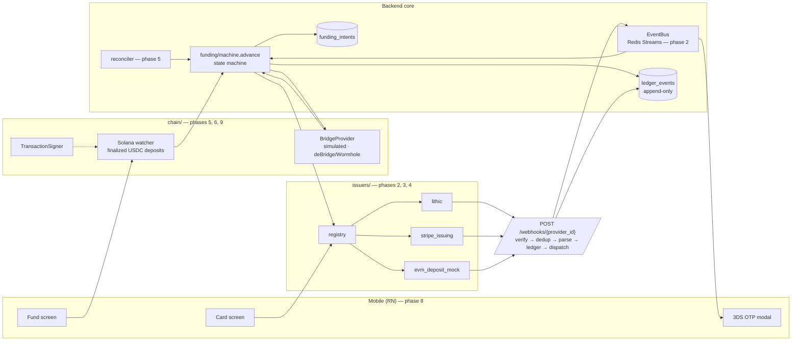

# Architecture

Sandbox demonstration of a card-funding pipeline. Testnets and provider sandboxes
only — no mainnet funds, no production card programs.

This document is the running record of design decisions. Sections marked
**deferred** land with the phase that builds them (see SPEC.md §12); everything
else is decided and implemented.

---

## 1. Target pipeline

Built so far: the core (`funding_intents`, `ledger_events`, `advance()`), the
issuer abstraction with the `evm_deposit_mock` adapter, the card lifecycle
endpoints, and the webhook receiver with its `EventBus`, retry queue and
dead-letter table. Everything else arrives in a later phase behind an interface
that already exists or is specified.

---

## 2. Decisions recorded in phase 1

### 2.1 The transition table

SPEC.md §5.1 names the states and says "`FAILED_<stage>` branches"; it does not
enumerate them. Chosen set, one per stage that can fail:

| From | To |
|---|---|
| `PENDING` | `PENDING` (retry) · `DEPOSIT_CONFIRMED` · `FAILED_DEPOSIT` |
| `DEPOSIT_CONFIRMED` | `BRIDGING` · `FAILED_BRIDGE` |
| `BRIDGING` | `BRIDGING` (retry) · `BRIDGED` · `FAILED_BRIDGE` |
| `BRIDGED` | `FUNDING` · `FAILED_FUNDING` |
| `FUNDING` | `FUNDING` (retry) · `FUNDED` · `FAILED_FUNDING` |
| `FUNDED` | `SETTLED` · `FAILED_SETTLEMENT` |
| `SETTLED`, `FAILED_*` | — terminal |

15 legal edges out of 121 ordered pairs. `tests/test_transition_table.py` asserts
this as a golden matrix, so widening the machine is never accidental, and
`tests/test_state_machine.py` exercises all 121 pairs against the database.

Two conventions follow from §5.3 ("retries with backoff up to a cap, **then**
marks `FAILED_*`"):

- **Retries are self-transitions.** A retry does not leave the state being
  retried: `BRIDGING → BRIDGING` bumps `retry_count`, stores the reason on the
  intent, and ledgers a `funding_intent.retried` event. Only the three states that
  wait on an external system (`PENDING`, `BRIDGING`, `FUNDING`) are retryable —
  the others are instantaneous hand-offs with nothing to re-poll.
- **`FAILED_*` is terminal.** A failed intent is a closed record; recovery means
  opening a new intent. Reopening a failure would let the ledger overwrite its own
  account of what happened, which defeats the point of §7.

`DEPOSIT_CONFIRMED → FAILED_BRIDGE` and `BRIDGED → FAILED_FUNDING` exist so a
submission that fails before the work starts still lands in the right bucket.

### 2.2 `advance()` owns its transaction

`advance()` and `create_intent()` commit before returning. The alternative —
caller-owned commits — cannot satisfy "illegal transitions raise **and are
ledgered**": an exception propagating out of an uncommitted transaction takes the
audit record with it. So the illegal-transition path writes its
`funding_intent.illegal_transition` entry, commits it, and only then raises. No
state was modified, so committing is safe.

Consequence, stated in the module docstring: a transition is the unit of work.
Callers should not batch unrelated writes into the same session.

The successful path writes the state change and its ledger entry in **one**
transaction, so you can never have one without the other.

### 2.3 Replay wins over legality

The idempotency-key lookup runs *before* the transition-table check. Under
at-least-once webhook delivery (SPEC.md §4) the second copy of an already-applied
event would otherwise look like an illegal repeat of a completed hop and turn into
a spurious 500 back to the provider. A known key means "already done" — a success
returning current state.

### 2.4 Dedup has two layers, and the durable one is the database

`idempotency_key` on `ledger_events` is `NULL`-able and unique. Postgres permits
many `NULL`s, so dedup is opt-in per call: chain-driven transitions pass no key,
webhook-driven ones pass the provider's event id.

`advance()` pre-checks the key, but the unique index is what actually enforces
uniqueness — the pre-check is only a fast path. If two workers race past it, the
insert fails and the loser collapses into a no-op. That path is asserted directly
(`test_unique_constraint_is_the_backstop_when_the_precheck_misses`) by blinding
the pre-check, which is what Redis eviction looks like in production. The handler
matches on the constraint name, so an unrelated `IntegrityError` is never
swallowed as a replay.

Redis (§4) becomes the first-line dedup cache in phase 2; this layer stands
without it.

### 2.5 Concurrency: row lock, and no stale reads

`advance()` loads the intent `FOR UPDATE`, so two workers cannot both apply the
same hop; the loser re-reads the new state and is rejected by the table. The load
also sets `populate_existing=True` — a row lock is worthless if the code then acts
on attribute values cached in the session's identity map from before the lock.

### 2.6 The ledger is append-only in the database, not by convention

A `BEFORE UPDATE OR DELETE` trigger raises `restrict_violation`. Application
discipline is not evidence; a trigger is. `TRUNCATE` is deliberately still
permitted (row triggers do not fire on it), which is what lets the test suite
reset cheaply between tests.

### 2.7 Identifier and ordering choices

- **`ledger_events.id` is a `BIGINT` identity column.** `occurred_at` can tie, and
  provider clocks are not ours to trust; the ledger needs a total order for
  projections and for reading a card's history as a narrative.
- **`funding_intents.id` is a UUID.** It doubles as the idempotent `funding_ref`
  passed to issuer adapters (§5.2 step 3), so it must be opaque, client-safe, and
  generated before any external call.
- **No foreign key from `ledger_events` to `funding_intents`.** An audit record
  must be writable for entities this service has never seen — an `unmapped`
  provider event (§3.3) — and must outlive whatever it refers to. Entity
  references are stored as opaque values, consistent with treating all external
  identifiers as opaque strings.

### 2.8 `Money` lives in `core/`, not `issuers/`

SPEC.md §3.1 first mentions `Money` in the issuer interface, but `ledger/` and
`funding/` need it too, and no module outside `issuers/` may import from
`issuers/`. So it is `app/core/money.py`: a frozen dataclass of
`(amount_minor: int, currency: str)` that rejects non-`int` amounts at
construction — including `bool`, which is an `int` subclass and would silently
mean "one cent". Negative amounts are legal (reversals, refunds). There is no
float constructor anywhere in the codebase.

### 2.9 Funding state is `VARCHAR` + `CHECK`, not a native Postgres enum

`native_enum=False`. Adding a state stays an ordinary migration instead of an
`ALTER TYPE ... ADD VALUE`, which cannot run inside a transaction block. The
machine is expected to grow; the schema should not fight that.

`ledger_events.state_before/state_after` are plain `VARCHAR(32)` rather than the
funding enum, because the same columns record card-lifecycle states from issuer
adapters.

### 2.10 Ledger event types are string constants, not an enum

`app/ledger/event_types.py` holds module-level constants. A closed enum would
force every new issuer adapter to edit a core module to add its event types —
exactly what the §3.2 abstraction rule forbids. Convention:
`<entity>.<past-tense-event>`.

### 2.11 Tests run against real Postgres

The suite creates its own `*_test` database if missing and migrates it with
Alembic, so every run also exercises the migration path (and
`tests/test_migrations.py` asserts models and migrations have not drifted, via
`compare_metadata`).

SQLite would be faster but models none of what this schema relies on: `JSONB`,
identity columns, `NULL`-permitting unique constraints, and the append-only
trigger. For a financial ledger, testing against a database that cannot express
its own invariants is not a saving.

Isolation is `TRUNCATE ... RESTART IDENTITY` before each test rather than a
rolled-back transaction, because `advance()` commits. The engine uses `NullPool`:
pytest-asyncio gives each test its own event loop, and asyncpg connections are
bound to the loop that opened them.

### 2.12 Local host ports are non-default

Postgres publishes on **5442** and Redis on **6389**, because 5432/6379 are
commonly already occupied. Container-internal ports are unchanged; CI uses the
defaults.

### 2.13 Dependency added beyond SPEC.md §2

`pydantic-settings` — the Pydantic v2 way to do env-var settings, split out of
Pydantic 1. Everything else is on the approved list. `httpx` is pulled in as a dev
dependency only, as FastAPI's own test transport.

### 2.14 Coverage scope grows per phase

SPEC.md §10 gates `funding/`, `webhooks/`, `issuers/`, `ledger/` at ≥60%.
`[tool.coverage.run] source` lists only the packages that exist in the current
phase, and each phase adds its own — otherwise the gate would measure absent code.
All four now exist and measure **100%** against the 60% floor.

### 2.15 Repository root

SPEC.md §1 names the root `stablecard-rail/`; this checkout is `crypto-card/`.
Everything inside matches the specified layout. Directories for unbuilt phases
(`app/chain/`, `mobile/`) are absent rather than empty, to keep "no scaffolding
ahead of the phase" visible in the tree.

---

## 3. Decisions recorded in phase 2

### 3.1 The registry holds factories, not instances

`issuers/registry.py` maps `provider_id` → a zero-argument factory, and memoizes
the first result. Two reasons it is not a dict of instances:

- Adapters read settings and (from phase 3) open HTTP clients. Doing that at import
  time makes configuration errors surface as import errors, in the wrong place.
- The memoized instance means a provider holding state — the mock's in-process
  simulator — is a singleton per process. Otherwise a card created through one call
  site would be invisible to the next.

Re-registering a `provider_id` raises unless `replace=True` is passed. A silent
collision would reroute money, because `provider_id` is what a funding intent
stores to decide who to pay.

**Adding an issuer is one adapter file plus one `register()` line** in
`app/issuers/__init__.py`. `tests/test_module_boundaries.py` reads the import graph
and fails if any module outside `issuers/` imports anything but `base` and
`registry`, or if any adapter imports `funding/`, `ledger/`, `webhooks/` or `api/`.
That is the difference between a design rule and a design aspiration — and it is
what phase 4 will demonstrate rather than discover.

### 3.2 Funding-model taxonomy

SPEC.md §3.1 puts `funding_model` on the interface; §3.2 asks the mock to prove the
abstraction spans both. The distinction is *what `fund_card` means*:

| | `FIAT_RAIL` (Lithic, Stripe) | `CRYPTO_DEPOSIT` (`evm_deposit_mock`) |
|---|---|---|
| Where money comes from | a program balance funded by bank transfer | a token transfer to a provider-assigned address |
| `fund_card` | debits the program balance | attributes an observed deposit to the card |
| `Card.deposit_address` | `None` | the address the bridge must send to |

Only two things in the shared models exist for the crypto side —
`Card.deposit_address` and the taxonomy enum itself — and both are optional or
inspectable, so a fiat adapter never invents a value it does not have. Everything
else provider-specific lives in `raw`.

Concretely, the mock's `fund_card` credits the card and then emits an asynchronous
`settlement` webhook, which is what SPEC.md §5.2 step 4 reconciles the intent
from. Phase 5's engine calls it only from `BRIDGED`, i.e. once funds have actually
reached the deposit address.

### 3.3 `webhook_event_id` and `get_card` are additions to §3.1

Two methods not in the spec's list:

- **`webhook_event_id(headers, body)`** — non-abstract, defaulting to `None`. SPEC.md
  §4 puts dedup *before* parse, which means the dedup key must be readable without
  trusting the body to be well-formed. That ordering is what makes an
  authentic-but-unreadable delivery safe: it is recorded once as `unmapped` instead
  of failing to parse on every redelivery, forever. Adapters whose provider has no
  envelope id inherit the default and the receiver falls back to `sha256(body)`.
  Whatever an adapter returns must be **covered by the signature** — otherwise the
  dedup key is forgeable, and a legitimate body can be replayed under a fresh id.
- **`get_card(card_id)`** — the freeze/unfreeze toggle and card screen (§9.1) need to
  read state without mutating it, and the ledger's `state_before` needs it too.

Both are asserted in `tests/test_issuer_interface.py`, which also fails if the
interface grows a third addition without this section being updated.

### 3.4 No local card table

Card routes are `/providers/{provider_id}/cards/{card_id}`: the provider is named
in the path rather than looked up from a local table, because there is no local
table. The provider owns card state, and a second copy here would be a cache that
can silently disagree with the thing it caches — exactly the class of bug that ends
with a frozen card that our API reports as active.

The cost is that a client must remember which provider issued a card. That is
acceptable now (a funding intent already stores `provider_id`) and will be revisited
in phase 5, which needs a `deposit_address → card` index for the chain watcher. That
index will be a projection of the ledger's `card.created` events, which already
record the deposit address for exactly this reason — not a second source of truth
about card state.

### 3.5 The ledger only records authenticated events

`POST /webhooks/{provider_id}` is open to the internet. A failed signature gets a
401, a log line, and nothing else: ledgering rejected traffic would let anyone write
to the audit log and exhaust the keyspace its unique index depends on. Signature
failures are a metrics-and-logs concern, not an evidence concern.

### 3.6 Dedup claims are released on failure

SPEC.md §4 specifies `SETNX` *before* the work, which is the right way round for
concurrency — two simultaneous deliveries cannot both pass. It opens one window:
claim, then die before the ledger write, and the provider's redelivery looks like a
duplicate for the life of the TTL (a day). So every failure path before commit calls
`DedupGate.release()`. `tests/test_webhook_receiver.py` asserts both halves — that
the claim is given back, and that the redelivery is then processed.

The durable layer is unchanged from phase 1: `ledger_events.idempotency_key` is
unique, and the receiver treats a violation on that specific constraint as "already
recorded". Any other `IntegrityError` propagates, so a real schema violation is
never mistaken for a duplicate.

### 3.7 Handler failure is our problem, not the provider's

Once verification succeeds the provider gets a 200 — including when a handler
throws. Answering 5xx would make the provider retry the whole delivery (re-running
handlers that already succeeded) and, with exponential backoff, eventually give up
on us. So a failed handler is queued individually:

- A Redis sorted set scored by "next due", claimed on read so two workers cannot
  run the same handler twice.
- Items are self-contained — the whole normalized event travels with the retry — so a
  retry works in another process, after a restart, or by hand from a dead-letter row.
- Backoff is config-driven (`WEBHOOK_RETRY_BACKOFF_SECONDS`, default
  `[2,8,32,128,512]`). Its **length is the retry cap**: one inline attempt plus one
  retry per step, then the delivery is dead-lettered.
- A handler whose subscription no longer exists — a deploy removed it — is
  dead-lettered immediately rather than cycling against a name nothing answers to.

Dead letters go to a table, not a Redis key, because giving up on a provider event
is an operational fact someone has to find later. One row per
`(provider_id, event_id, handler)` via `ON CONFLICT DO NOTHING`, so a second worker
reaching the same conclusion does not double-report. First arrivals are ledgered as
`webhook.dead_lettered`; suppressed duplicates are not.

Draining is `scripts/drain_webhook_retries.py`, a separate process. A retry worker
inside the web process is one that dies with it and that nobody can run by hand.

### 3.8 Kafka vs Redis Streams

The `EventBus` interface is the architectural point; `RedisStreamsEventBus` is the
implementation. Redis Streams is a real fit rather than a fudge — ordered entries,
monotonic ids, and a consumer can resume from the last id it processed, which is
what a replayable log needs. What it lacks against Kafka is partitioning, retention
policy, and multi-broker durability. A Kafka implementation is a drop-in: consumers
receive `CardEvent`s and never learn what carried them.

Two operational details: publishing happens before handlers run and unconditionally,
so a consumer added in phase 5 can replay the stream from the beginning; and the
stream is length-capped, because Redis has no per-entry TTL and an uncapped stream
is an unbounded memory leak.

### 3.9 Ledger event naming for provider events

Provider events are recorded as `provider.<normalized_type>` —
`provider.authorization`, `provider.settlement`, `provider.unmapped` — via
`event_types.provider_event()`. One namespace for "things a provider told us", as
against `card.*` for things we did and `funding_intent.*` for state changes. It is a
function rather than a constant per case so `ledger/` never has to import the
`CardEventType` vocabulary.

### 3.10 No consumers are subscribed yet

`dispatch.subscribe()` exists and is fully tested; phase 2 registers nothing. The
funding engine subscribes in phase 5 and the OTP service in phase 7. Each handler
must document its idempotency key at the subscription site, per SPEC.md §4 — a
handler can be re-run by a retry, by a drain in another process, or by hand from a
dead-letter row. `tests/test_webhook_dispatch.py` asserts that booting the app
registers no handlers, so a consumer cannot appear ahead of its phase by accident.

### 3.11 The mock provider is a package, and its secret is not a secret

`issuers/evm_deposit_mock/` is a directory rather than one file because it ships the
*provider* as well as the adapter: `adapter.py` is the one file a real issuer needs,
while `simulator.py` and `signing.py` stand in for servers that, for Lithic and
Stripe, belong to someone else.

The simulator signs its own webhooks with `EVM_DEPOSIT_MOCK_WEBHOOK_SECRET`, which
has a default value in `.env.example` and in `Settings`. That is not a violation of
"no secrets in the repo": the provider it authenticates to is a Python object in
this process, so the key grants access to nothing. Real adapter credentials (phases
3 and 4) will have no defaults and no example values.

Everything the simulator produces is deterministic — per-kind counters for ids,
hash-derived deposit addresses — so a demo run twice produces the same output and a
test never has to know a random value. `last_four` is a repeating synthetic pattern
that could not be mistaken for card-number material, and there is no PAN or CVV
anywhere: reveal is a separate short-lived single-use path in phase 8.

---

## 4. Decisions recorded in phase 3

### 4.1 `parse_webhook` takes the headers as well as the body

SPEC.md §3.1 sketches `parse_webhook(self, body: bytes)`. Lithic does not fit that
signature, and the mismatch is not cosmetic:

- the event id is in the **`webhook-id` header**, not the body. Lithic's delivered
  body is the event *payload* only — no envelope, no id, no delivery timestamp. The
  documented worked example makes this explicit: the signed body in their own
  verification example is `{"acquirer_fee":0,"amount":2000,"authorization_amount":2000}`;
- `card.created` payloads are `{card_token, event_type, replacement_for}` — there is
  **no timestamp anywhere in the body**, so `CardEvent.occurred_at` has to come from
  the `webhook-timestamp` header.

Both are required fields on `CardEvent`, so a body-only `parse_webhook` cannot
produce one. The three ways out were: smuggle the headers in through adapter state,
have the receiver pass a pre-resolved id, or widen the interface. The first is
invisible coupling; the second still leaves no timestamp. So the interface widened
to `parse_webhook(headers, body)`, matching `verify_webhook(headers, body)`, and the
asymmetry between the two webhook methods is gone.

Per the working agreement this is the outcome the rule wants: an adapter that does
not fit means the abstraction is wrong, not that the adapter should be bent. It cost
one signature, one call site in `webhooks/receiver.py`, and no change to `funding/`,
`ledger/` or `api/`. Phase 4's Stripe adapter reads its id from the body and will
simply ignore the argument, exactly as `evm_deposit_mock` now does.

Asserted structurally by `tests/test_issuer_interface.py`, so it cannot silently
narrow again.

### 4.2 Adapters share `base.py` and `core/`, and nothing else

`lithic/signing.py` and `evm_deposit_mock/signing.py` both contain a six-line
case-insensitive header lookup. That duplication is deliberate.

The rule being protected is "adding an issuer is one adapter file plus one registry
entry". A helper extracted because two adapters wanted it becomes a module the third
adapter has to be written against, and then a module that cannot change without
touching every adapter — which is the same coupling the abstraction exists to
prevent, moved one level down. Six duplicated lines cost less than that, and the two
schemes are genuinely different: Lithic's signature is base64 with a `v1,` prefix
and rotation support, the mock's is hex with a `v1=` prefix.

`tests/test_module_boundaries.py` now enforces this in both directions: no module
outside `issuers/` imports an adapter, no adapter imports the pipeline, and no
adapter imports another adapter. `issuers/__init__.py` is exempt from the last one —
naming every adapter is precisely its job.

What adapters *may* share is `app/core/` (`Money`, settings) and `issuers/base.py`.
Both are stable by construction: `base.py` is the contract, and a change to it is
already a breaking change that `tests/test_issuer_interface.py` will report.

### 4.3 An HTTP client, and not Lithic's SDK

SPEC.md §2 names no HTTP client, because phases 1 and 2 needed none. §3.2 requires
real provider calls, so phase 3 does. `httpx` moves from a dev dependency to a
runtime one and `respx` joins the dev ones — `respx` was pre-approved and is
`httpx`-specific, so this is the same decision arriving in two files.

Not the vendor SDK, for three reasons. It brings its own retry policy and its own
models, which would then have to be translated twice — once from their types into
ours, and once around whatever they retry. Its surface is far larger than the eight
endpoints this adapter touches. And phase 4 adds Stripe: two vendor SDKs with two
opinions about connection handling is more code than two small clients, not less.
What the adapter actually needs is four verbs, one auth header, cursor pagination and
error translation, and that is `client.py` — 85 statements, tested to 100%.

`client.py` opens one `httpx.AsyncClient` per request rather than holding one for the
process. A pooled client would be faster, but it is a resource with a lifetime, and
the registry hands out memoized adapters with no `aclose()` in the interface. Adding
a shutdown hook to `CardIssuerAdapter` for something only one adapter has is the kind
of leak §4.1 exists to prevent, and per-request setup is invisible at sandbox scale.
Recorded as a production-path item in §5.

### 4.4 Funding a Lithic card raises its spend limit

**This program has no ledger.** `POST /v1/financial_accounts` answers 403 and
`GET /v1/balances?account_token=…` answers 400 "Account does not support this
operation". So the documented production path — a book transfer into the account's
`ISSUING` financial account, with a client-supplied `token` that is idempotent by
construction — cannot be built or recorded here.

What the program does expose per card is `spend_limit`. So:

- **funding** = `PATCH /v1/cards/{token}` raising `spend_limit` by the amount;
- **balance** = that limit, minus the sum of `amounts.hold` and `amounts.cardholder`
  over the card's transactions.

Three things had to be learned by walking the API rather than reading about it:

1. **`spend_limit: 0` means *unlimited*, not "nothing".** So a zero-limit card cannot
   be expressed at all, and both `create_card` and `fund_card` refuse rather than
   quietly hand out an unlimited card.
2. **`spend_limit_duration` is forced to `TRANSACTION` when the limit is 0**, and a
   later `PATCH` of the limit alone does not change it back. Every write therefore
   restates `FOREVER` — on any other window the limit resets, and funding would leak
   away with the calendar.
3. **The `hold` + `cardholder` sum covers every transaction state** with no status
   table: a pending authorization is a negative `hold`, a settled one a negative
   `cardholder`, a refund positive, and a declined or voided transaction zero on
   both.

### 4.5 The funding idempotency record lives in the card's memo

`fund_card`'s contract is that two calls with one `funding_ref` fund once (SPEC.md
§10). Lithic supports `Idempotency-Key` on `POST /v1/cards` and
`POST /v1/financial_accounts` only — not on the `PATCH` that funding uses — and a
limit raise is a read-add-write, which is exactly the shape that double-applies.

An adapter is stateless with respect to our database (it may not import `funding/` or
`ledger/`), so the record has to live at the provider. The only writable free-text
field a card has is `memo`, so a funding writes
`"<label> [fund:<ref>:<amount_minor>]"` alongside the cardholder's own label, and
`fund_card` reads it back before doing anything. That the *provider* holds it is the
point: it survives our process dying mid-call, which is the failure this contract
exists for.

Bought:

- an immediately retried funding is applied once and returns the same result;
- a ref replayed with **different terms** is refused rather than re-applied, so a
  caller bug is a loud error instead of a double-funded card;
- the tag replaces rather than accumulates, and truncates the label rather than the
  tag if the memo runs long.

Not bought: **only the most recent ref is remembered.** Replaying a *stale* ref after
a newer funding has landed would re-apply it. That is bounded by how the funding
engine works — one intent per card at a time, `PENDING → FUNDED`, retrying the
current intent — and by phase 1's ledger, which dedups on the intent's idempotency
key before an adapter is called at all. It is stated here rather than hidden because
it is a real limit of the scheme, and on a ledger-enabled program the book-transfer
path replaces it with provider-side idempotency and no tag at all.

### 4.6 A Lithic transaction event is keyed on its newest entry, not its status

Lithic sends one event type — `card_transaction.updated` — for the whole life of a
card transaction, re-delivering the entire transaction object each time it changes.
The same event type is therefore an authorization, then its clearing, then possibly a
reversal.

The `status` field is the tempting thing to key on and the wrong one. A voided
authorization arrives with `status: VOIDED`, which says what the transaction *is*, not
what happened — the reversal that caused this delivery would be lost, and `VOIDED` has
no normalized equivalent anyway. So the mapping keys on the newest entry in `events[]`
(by its own `created`, falling back to array order), and `provider_event_type` becomes
a compound label: `card_transaction.updated:CLEARING`.

Consequences worth stating:

- every flavour of authorization (`AUTHORIZATION`, `FINANCIAL_AUTHORIZATION`,
  `AUTHORIZATION_ADVICE`, and the three credit variants) maps to `authorization`;
  those distinctions are network mechanics, not different things to a ledger;
- `BALANCE_INQUIRY` and `RETURN_REVERSAL` are deliberately *not* mapped. Neither has a
  normalized equivalent, and a near-miss is worse than `unmapped` — which keeps the
  full label and the raw payload (SPEC.md §3.3);
- a **declined** authorization is still an `authorization`. There is no normalized
  field for the result, and adding one for a provider detail is what `raw` is for.

### 4.7 `CardEvent.amount` is a magnitude; the type carries the direction

Lithic signs its event amounts: a reversal is `-500`, a refund `-250`, a purchase
`+1234`. `CardEventType` already distinguishes `refund` from `settlement` and
`authorization_reversal` from `authorization`, so a sign in the amount would be the
same information twice — and the second copy is where double-negation bugs live. The
mapping stores `abs()` and leaves `effective_polarity` in `raw`.

This also keeps the two adapters agreeing: `evm_deposit_mock` emits positive amounts
for refunds, and if Lithic reported `-250` for the same event, no consumer could sum a
ledger without knowing which provider wrote each row.

Two related decisions in the same place:

- **A dispute has no card.** `dispute.updated` identifies a `transaction_token`, not a
  card. Resolving it would take an API call, and `parse_webhook` is pure — the
  receiver calls it a second time for duplicate deliveries. So a chargeback has
  `card_id = None`, with the transaction token in `raw`.
- **A 3DS challenge amount is not normalized at all.** Lithic states it as a decimal
  number plus a `currency_exponent`. Money here is integer minor units only, the
  conversion is exact but only via `Decimal`, and there is no recorded delivery to
  check it against — so `amount` is `None` and the provider's own numbers stay in
  `raw` for phase 7 to convert where it displays them.

---

## 5. Deferred decisions

Recorded here when their phase lands, per SPEC.md §11:

- **Why CCTP cannot serve a Solana→Gnosis Chain route**, and what that implies for
  reconciliation — phase 6, with the bridge adapter. (SPEC.md §5.2 names Gnosis
  Chain as the destination, because that is where a Gnosis Pay Safe lives.)
- **deBridge vs Wormhole**, chosen on which has a working Solana→Gnosis Chain
  testnet route at build time — phase 6. Gnosis Pay's own third-party-bridge page
  lists deBridge for "Solana USDC → Gnosis", alongside NEAR Intents, Bungee, LiFi
  and CoW Swap, so the mainnet route exists; whether a Chiado testnet route does is
  the open question.
- **`deposit_address → card` index** for the chain watcher, projected from the
  ledger's `card.created` events — phase 5 (see §3.4).
- **Reconciler thresholds** for stuck intents — phase 5.
- **A retryable marker on issuer errors.** `lithic/client.py` already knows which
  failures are worth retrying (429, 5xx, timeouts) and retries them itself, but that
  knowledge cannot cross `issuers/base.py` — so the funding engine cannot yet tell
  "the provider is busy" from "the provider refused". Phase 5 needs the distinction to
  decide between a retry and a `FAILED` intent; adding it before there is a consumer
  would be guessing at the shape.
- **A pooled HTTP client with a shutdown hook.** `lithic/client.py` opens a
  connection per request to avoid putting a resource lifetime on the issuer interface
  (§4.3). A production path pools connections and closes them from a FastAPI lifespan,
  which needs an `aclose()` on `CardIssuerAdapter` that every adapter would inherit
  for one adapter's benefit — worth doing when a second adapter also needs it.
- **Book-transfer funding** for a ledger-enabled Lithic program, replacing the memo
  tag with provider-side idempotency (§4.4, §4.5). Needs a program this sandbox does
  not have.
- **Signer**: `LocalKeypairSigner` (default) and `FireblocksSigner` behind one
  `TransactionSigner` interface — phases 5 and 9.

Deliberately out of scope for the whole project, as production-path items:
Kafka itself, real KYC, physical cards.

---

## 6. Module dependency rule

Every module outside `app/issuers/` may import only `issuers/base.py` and
`issuers/registry.py`; no adapter may import `funding/`, `ledger/`, `webhooks/` or
`api/`. If adding a second adapter required a change to any of those, that is a
design bug in the abstraction, not something to patch around (SPEC.md §12 phase 4
exists to test exactly this).

Enforced by `tests/test_module_boundaries.py`, which parses the import graph rather
than trusting review.
