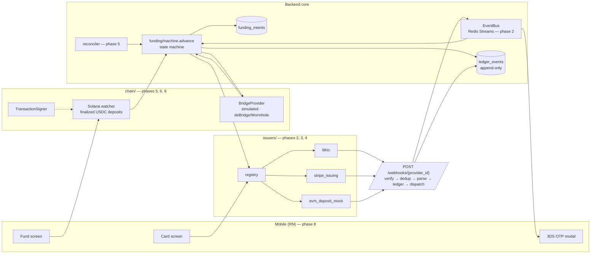

# Architecture

Sandbox demonstration of a card-funding pipeline. Testnets and provider sandboxes
only — no mainnet funds, no production card programs.

This document is the running record of design decisions. Sections marked
**deferred** land with the phase that builds them (see SPEC.md §12); everything
else is decided and implemented.

---

## 1. Target pipeline

Phase 1 (built) is the shaded core: `funding_intents`, `ledger_events`, and
`advance()`. Everything reaching into it arrives in a later phase behind an
interface that already exists or is specified.

---

## 2. Decisions recorded in phase 1

### 2.1 The transition table

SPEC.md §5.1 names the states and says "`FAILED_<stage>` branches"; it does not
enumerate them. Chosen set, one per stage that can fail:

| From | To |
|---|---|
| `PENDING` | `PENDING` (retry) · `DEPOSIT_CONFIRMED` · `FAILED_DEPOSIT` |
| `DEPOSIT_CONFIRMED` | `BRIDGING` · `FAILED_BRIDGE` |
| `BRIDGING` | `BRIDGING` (retry) · `BRIDGED` · `FAILED_BRIDGE` |
| `BRIDGED` | `FUNDING` · `FAILED_FUNDING` |
| `FUNDING` | `FUNDING` (retry) · `FUNDED` · `FAILED_FUNDING` |
| `FUNDED` | `SETTLED` · `FAILED_SETTLEMENT` |
| `SETTLED`, `FAILED_*` | — terminal |

15 legal edges out of 121 ordered pairs. `tests/test_transition_table.py` asserts
this as a golden matrix, so widening the machine is never accidental, and
`tests/test_state_machine.py` exercises all 121 pairs against the database.

Two conventions follow from §5.3 ("retries with backoff up to a cap, **then**
marks `FAILED_*`"):

- **Retries are self-transitions.** A retry does not leave the state being
  retried: `BRIDGING → BRIDGING` bumps `retry_count`, stores the reason on the
  intent, and ledgers a `funding_intent.retried` event. Only the three states that
  wait on an external system (`PENDING`, `BRIDGING`, `FUNDING`) are retryable —
  the others are instantaneous hand-offs with nothing to re-poll.
- **`FAILED_*` is terminal.** A failed intent is a closed record; recovery means
  opening a new intent. Reopening a failure would let the ledger overwrite its own
  account of what happened, which defeats the point of §7.

`DEPOSIT_CONFIRMED → FAILED_BRIDGE` and `BRIDGED → FAILED_FUNDING` exist so a
submission that fails before the work starts still lands in the right bucket.

### 2.2 `advance()` owns its transaction

`advance()` and `create_intent()` commit before returning. The alternative —
caller-owned commits — cannot satisfy "illegal transitions raise **and are
ledgered**": an exception propagating out of an uncommitted transaction takes the
audit record with it. So the illegal-transition path writes its
`funding_intent.illegal_transition` entry, commits it, and only then raises. No
state was modified, so committing is safe.

Consequence, stated in the module docstring: a transition is the unit of work.
Callers should not batch unrelated writes into the same session.

The successful path writes the state change and its ledger entry in **one**
transaction, so you can never have one without the other.

### 2.3 Replay wins over legality

The idempotency-key lookup runs *before* the transition-table check. Under
at-least-once webhook delivery (SPEC.md §4) the second copy of an already-applied
event would otherwise look like an illegal repeat of a completed hop and turn into
a spurious 500 back to the provider. A known key means "already done" — a success
returning current state.

### 2.4 Dedup has two layers, and the durable one is the database

`idempotency_key` on `ledger_events` is `NULL`-able and unique. Postgres permits
many `NULL`s, so dedup is opt-in per call: chain-driven transitions pass no key,
webhook-driven ones pass the provider's event id.

`advance()` pre-checks the key, but the unique index is what actually enforces
uniqueness — the pre-check is only a fast path. If two workers race past it, the
insert fails and the loser collapses into a no-op. That path is asserted directly
(`test_unique_constraint_is_the_backstop_when_the_precheck_misses`) by blinding
the pre-check, which is what Redis eviction looks like in production. The handler
matches on the constraint name, so an unrelated `IntegrityError` is never
swallowed as a replay.

Redis (§4) becomes the first-line dedup cache in phase 2; this layer stands
without it.

### 2.5 Concurrency: row lock, and no stale reads

`advance()` loads the intent `FOR UPDATE`, so two workers cannot both apply the
same hop; the loser re-reads the new state and is rejected by the table. The load
also sets `populate_existing=True` — a row lock is worthless if the code then acts
on attribute values cached in the session's identity map from before the lock.

### 2.6 The ledger is append-only in the database, not by convention

A `BEFORE UPDATE OR DELETE` trigger raises `restrict_violation`. Application
discipline is not evidence; a trigger is. `TRUNCATE` is deliberately still
permitted (row triggers do not fire on it), which is what lets the test suite
reset cheaply between tests.

### 2.7 Identifier and ordering choices

- **`ledger_events.id` is a `BIGINT` identity column.** `occurred_at` can tie, and
  provider clocks are not ours to trust; the ledger needs a total order for
  projections and for reading a card's history as a narrative.
- **`funding_intents.id` is a UUID.** It doubles as the idempotent `funding_ref`
  passed to issuer adapters (§5.2 step 3), so it must be opaque, client-safe, and
  generated before any external call.
- **No foreign key from `ledger_events` to `funding_intents`.** An audit record
  must be writable for entities this service has never seen — an `unmapped`
  provider event (§3.3) — and must outlive whatever it refers to. Entity
  references are stored as opaque values, consistent with treating all external
  identifiers as opaque strings.

### 2.8 `Money` lives in `core/`, not `issuers/`

SPEC.md §3.1 first mentions `Money` in the issuer interface, but `ledger/` and
`funding/` need it too, and no module outside `issuers/` may import from
`issuers/`. So it is `app/core/money.py`: a frozen dataclass of
`(amount_minor: int, currency: str)` that rejects non-`int` amounts at
construction — including `bool`, which is an `int` subclass and would silently
mean "one cent". Negative amounts are legal (reversals, refunds). There is no
float constructor anywhere in the codebase.

### 2.9 Funding state is `VARCHAR` + `CHECK`, not a native Postgres enum

`native_enum=False`. Adding a state stays an ordinary migration instead of an
`ALTER TYPE ... ADD VALUE`, which cannot run inside a transaction block. The
machine is expected to grow; the schema should not fight that.

`ledger_events.state_before/state_after` are plain `VARCHAR(32)` rather than the
funding enum, because the same columns record card-lifecycle states from issuer
adapters.

### 2.10 Ledger event types are string constants, not an enum

`app/ledger/event_types.py` holds module-level constants. A closed enum would
force every new issuer adapter to edit a core module to add its event types —
exactly what the §3.2 abstraction rule forbids. Convention:
`<entity>.<past-tense-event>`.

### 2.11 Tests run against real Postgres

The suite creates its own `*_test` database if missing and migrates it with
Alembic, so every run also exercises the migration path (and
`tests/test_migrations.py` asserts models and migrations have not drifted, via
`compare_metadata`).

SQLite would be faster but models none of what this schema relies on: `JSONB`,
identity columns, `NULL`-permitting unique constraints, and the append-only
trigger. For a financial ledger, testing against a database that cannot express
its own invariants is not a saving.

Isolation is `TRUNCATE ... RESTART IDENTITY` before each test rather than a
rolled-back transaction, because `advance()` commits. The engine uses `NullPool`:
pytest-asyncio gives each test its own event loop, and asyncpg connections are
bound to the loop that opened them.

### 2.12 Local host ports are non-default

Postgres publishes on **5442** and Redis on **6389**, because 5432/6379 are
commonly already occupied. Container-internal ports are unchanged; CI uses the
defaults.

### 2.13 Dependency added beyond SPEC.md §2

`pydantic-settings` — the Pydantic v2 way to do env-var settings, split out of
Pydantic 1. Everything else is on the approved list. `httpx` is pulled in as a dev
dependency only, as FastAPI's own test transport.

### 2.14 Coverage scope grows per phase

SPEC.md §10 gates `funding/`, `webhooks/`, `issuers/`, `ledger/` at ≥60%.
`[tool.coverage.run] source` lists only the packages that exist in the current
phase, and each phase adds its own — otherwise the gate would measure absent code.
Phase 1 measures `funding/` + `ledger/`: **100%**, against a 60% floor.

### 2.15 Repository root

SPEC.md §1 names the root `stablecard-rail/`; this checkout is `crypto-card/`.
Everything inside matches the specified layout. Directories for unbuilt phases
(`app/issuers/`, `app/chain/`, `app/webhooks/`, `mobile/`) are absent rather than
empty, to keep "no scaffolding ahead of the phase" visible in the tree.

---

## 3. Deferred decisions

Recorded here when their phase lands, per SPEC.md §11:

- **Issuer registry design** and the "new issuer = one file" enforcement — phase 2.
- **Funding-model taxonomy** (`FIAT_RAIL` vs `CRYPTO_DEPOSIT`) — phase 2.
- **Why CCTP cannot serve a Solana→BSC route**, and what that implies for
  reconciliation — phase 6, with the bridge adapter.
- **deBridge vs Wormhole**, chosen on which has a working Solana→BSC testnet route
  at build time — phase 6.
- **Kafka vs Redis Streams**: an `EventBus` interface with a Redis Streams
  implementation stands in; a Kafka implementation would be a drop-in — phase 2.
- **Signer**: `LocalKeypairSigner` (default) and `FireblocksSigner` behind one
  `TransactionSigner` interface — phases 5 and 9.

Deliberately out of scope for the whole project, as production-path items:
Kafka itself, real KYC, physical cards.

---

## 4. Module dependency rule

Enforced by review now, by structure from phase 2: every module outside
`app/issuers/` may import only `issuers/base.py` and `issuers/registry.py`. If
adding a second adapter required a change to `funding/`, `ledger/`, `webhooks/` or
the mobile client, that is a design bug in the abstraction, not something to patch
around (SPEC.md §12 phase 4 exists to test exactly this).

Phase 1 has no `issuers/` package, so the rule is trivially held: `funding/` and
`ledger/` depend only on `core/`.
